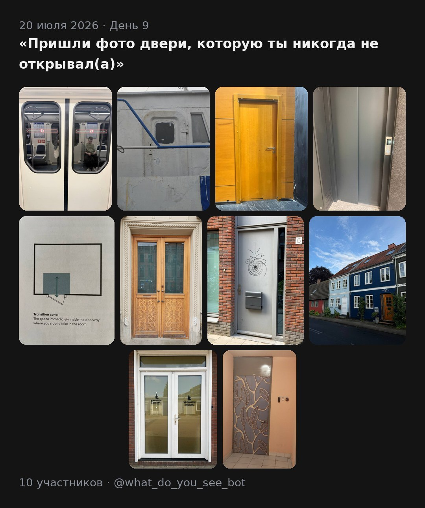

<h1 align="center">📸 photobot</h1>

<p align="center">
  <b>One prompt a day. One photo each. One collage back.</b><br>
  A quiet daily ritual for a closed circle of friends.
</p>

<p align="center">
  <a href="https://t.me/what_do_you_see_bot"><b>@what_do_you_see_bot</b></a> ·
  self-hosted Telegram bot · 🇬🇧 EN / 🇷🇺 RU ·
  <a href="DESIGN.md">design notes</a>
</p>

<p align="center">
  
</p>

<p align="center">
  <sub><i>Day 9 — “send a photo of a door you've never opened.” Ten people, ten
  doors, one card back. This copy went out in Russian; everyone gets the
  collage in their own language.</i></sub>
</p>

---

Every morning the bot sends everyone the same tiny creative prompt. Each person
replies with **one** photo before the evening deadline. Then the bot stitches
that day's photos into a single card and sends it back — **only to the people
who played**. Next morning, a new prompt.

No feed, no likes, no strangers. Just a reason to look a little closer at an
ordinary day, and the small pleasure of seeing what nine other people found.

## A day in the life

| | |
|---|---|
| **09:00** | A prompt from the curated bilingual library goes out to everyone at once |
| all day | People send photos. A new one replaces your old one, right up to the deadline |
| **19:00** | A gentle nudge — only to whoever hasn't played yet |
| **21:00** | Deadline. Late photos are politely turned away. You get a numbered contact sheet |
| your call | You moderate (`/exclude 3`, `/preview`) and press send. **The collage never goes out on its own** |
| 🎉 | Everyone who played gets the card, their streak, and a row of rating buttons |

Times are Europe/Berlin, live in the DB, and change from the admin chat with
`/settimes` — no restart, applies within a minute.

## The prompts

> Send a photo of something you almost threw away
> · a shadow that looks like something else
> · the oldest thing in your pocket
> · something broken but beautiful
> · a letter or number found in the wild
> · the most boring thing near you — make it interesting

The queue lives in the bot ([`prompts.txt`](prompts.txt) is the starter set).
Add one with `/addprompt`, reorder the whole thing by exporting a `.txt` and
re-uploading it, or let players pitch their own with `/suggest_prompt` — an
approved idea ships with the suggester's name baked in.

## What's in the box

- 🖼 **A card, not a grid** — a justified mosaic that adapts to however many
  photos came in, with the date, the prompt and the day number on it
- 🔍 **Tap to zoom** — busy days also arrive as an uncompressed hi-res file,
  because ten photos in one Telegram image get small
- ❤️ **Ratings** — a row of emoji under each collage, tallies shared live
  across every copy
- 🔥 **Streaks** — your run of consecutive days rides along in the caption
- 💬 **Story of the day** — the bot can ask one author why they chose their
  photo, and publish the answer back to that day's players — in both languages
  if you pair it with a translation
- 📊 **Polls** — ad-hoc 👍/👎 questions to the whole group, with a live tally
- 🧹 **Moderation first** — nothing is published until you've looked at it
- 🌍 **Per-user language** — everyone reads the bot, and gets the collage, in
  EN or RU
- 🏠 **Yours** — long polling means no open ports; the photos never leave your
  machine

## Run it

```bash
cp .env.example .env      # BOT_TOKEN from @BotFather, ADMIN_IDS from @userinfobot
docker compose up -d
```

Or without Docker:

```bash
python3 -m venv .venv && .venv/bin/pip install -r requirements.txt
.venv/bin/python -m photobot.main
```

Then in Telegram: `/start` the bot, `/admin` lists every admin command,
`/addprompt Send a photo of water | Пришли фото с водой`, `/forceprompt` to
fire it now, send a photo, `/preview` to see the collage.

Tests: `.venv/bin/python -m pytest tests/`

> **Running it for a private circle?** Set `ALLOWED_IDS` to a comma-separated
> list of user ids and the bot ignores everyone else. Left empty, anyone who
> finds the bot's @name can join, play, and receive that day's collage — you
> get a DM about each new arrival, but that's after the fact.

## Running it day to day

`/admin` prints the full list; the ones you'll actually use:

| | |
|---|---|
| `/status` | today at a glance — prompt sent? who's in? collage pending? |
| `/exclude N` · `/include N` · `/ban N` | moderate the contact sheet |
| `/preview` · `/forcecollage` | see it, then send it |
| `/delcollage` | unsend a collage everywhere (Telegram allows 48 h) and reset the day |
| `/settimes` · `/times` | move the day's clock |
| `/stats` · `/users` · `/feedback_all` | who's playing, what they think |
| `/errors` · `/version` | last log lines, which build is running |

Every crash is DM'd to the admins with a traceback, and a tick job every minute
compares the clock to the day's state — so a reboot or a runtime schedule
change can't silently kill a day.

## Deploying

Anywhere Docker runs. The setup this one actually lives on — a Synology NAS
that redeploys itself on `git push` — is written up in
**[docs/deploy-synology.md](docs/deploy-synology.md)**.

The DB and photos live in `data/`, outside the image. That's the only thing to
back up.

## Under the hood

Python 3.12 · [`python-telegram-bot`](https://python-telegram-bot.org) v21
(async, built-in JobQueue) · Pillow for the collage · SQLite · Docker.

Full design notes, including the collage layout algorithm and the catch-up
logic, in **[DESIGN.md](DESIGN.md)**.
